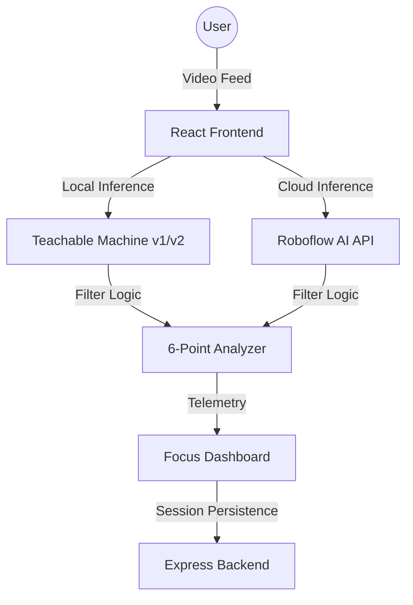

# 🛡️ DeepWork AI | Study & Focus Monitor

A high-performance, real-time AI vision application designed to eliminate workspace distractions and enforce deep focus. Now upgraded to a **6-Point Detection System** with a dual-model vision engine.

> [!IMPORTANT]
> This project leverages **Teachable Machine v2 (Image & Pose)** and **TensorFlow.js** for browser-side, low-latency object detection. It is built with a premium **React** dashboard and a secure, login-first architecture.

---

## ✨ Features

- **🎯 Triple-Engine Vision Strategy**: Choose your performance level:
  - **Fast Mode (TM v1)**: Zero-latency, browser-native 4-class detection.
  - **Balanced Mode (TM v2)**: Dual-model (Image + Pose) 6-point analysis for maximum stability.
  - **Precision Mode (Roboflow AI)**: Cloud-based high-fidelity inference for complex workspace environments.
- **🤖 6-Point Vision Analysis**: Sophisticated monitoring detecting Focused, Phone usage, Looking Away, Absence, Yawning, and Multiple People.
- **🌓 Unified Theme Engine**: Seamlessly switch between **Dark Mode (Midnight)**, **Light Mode (High Contrast)**, or **System Sync**.
- **🔐 Security & Privacy**: 
  - **Mandatory Login**: Strict authentication-first flow for all sessions.
  - **Danger Zone**: Integrated tools for **Resetting History** and **Permanent Account Deletion**.
- **📊 Professional Dashboard**: Real-time AI telemetry, distraction event logs, and persistent session history.
- **🎨 Premium Aesthetics**: Modern design system with glassmorphism, responsive sidebar, and high-performance micro-animations.

---

## 🏗️ Architecture



---

## 🚀 Quick Start

### 1. Unified Setup
The project is built as a single, integrated repository. To install all dependencies:
```bash
npm install --legacy-peer-deps
```

### 2. Launch
Start both the **AI Monitor** and the **Analytics Server** with one command:
```bash
npm run dev
```

- **Dashboard**: [http://localhost:5173](http://localhost:5173)
- **API Server**: [http://localhost:5000](http://localhost:5000)

---

## 🛠️ Tech Stack

- **Frontend**: Vite, React, Lucide, Recharts, Framer Motion
- **AI Engines**: TensorFlow.js, Teachable Machine, Roboflow Inference API
- **Backend**: Node.js, Express, Cors, Morgan
- **Styling**: Vanilla CSS (Thematic Variable System)

---

## 📝 Usage Tips
- **Initialize Guard**: Click to start the webcam. The app will auto-load the dual AI models (v1/v2).
- **Appearance Settings**: Control theme and accent colors from the **Settings > Appearance** tab.
- **Danger Zone**: Use the tools at the bottom of the Settings page to manage your data privacy.
- **Login-First**: Refreshing the page or starting a new session will always require a secure login.

---

Created by [Krrish0221](https://github.com/Krrish0221)
