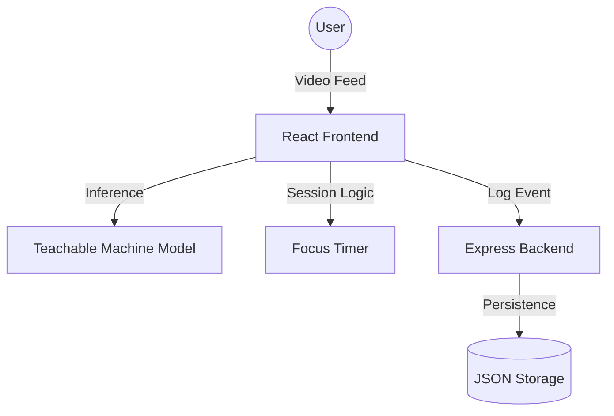

# 🛡️ DeepWork AI | Study & Focus Monitor

A high-performance, real-time AI vision application designed to eliminate workspace distractions and enforce deep focus. 

> [!IMPORTANT]
> This project leverages **Teachable Machine** and **TensorFlow.js** for browser-side, low-latency object detection. It is built with a premium **React** dashboard and an **Express** analytics backend.

---

## ✨ Features

- **🎯 AI surveillance**: Real-time monitoring of your workspace via webcam.
- **📱 Distraction Detection**: Automatically detects phones or specific "distracted" poses using a custom AI model.
- **📊 Interactive Dashboard**: A glassmorphic, theme-aware UI featuring:
  - **Focus Timer**: Tracks your deep work duration.
  - **Distraction Counter**: Tallies every time focus is broken.
  - **Real-time Chart**: Live AI confidence timeline using Recharts.
- **🌓 Unified Theme Engine**: Seamlessly switch between **Dark Mode**, **Light Mode (Frosted Ice)**, or **System Sync** using a root-level token system.
- **🔐 Identity & Security**: 
  - **Avatar Management**: Dual-mode identity system (Initials vs. Custom Uploads) with premium presets.
  - **Email Verification**: Secure 4-digit OTP verification system with success animations.
- **🕒 Session History**: Persistent logging of your focus sessions for long-term productivity analysis.
- **🎨 Premium Aesthetics**: Modern design system with glassmorphism, smooth micro-interactions, and transition-aware UI.

---

## 🏗️ Architecture



---

## 🚀 Quick Start

### 1. Unified Setup
The project is built as a single, integrated repository. To install all dependencies:
```bash
npm install --legacy-peer-deps
```

### 2. Launch
Start both the **AI Monitor** and the **Analytics Server** with one command:
```bash
npm run dev
```

- **Dashboard**: [http://localhost:5173](http://localhost:5173)
- **API Server**: [http://localhost:5000](http://localhost:5000)

---

## 🛠️ Tech Stack

- **Frontend**: Vite, React, Lucide, Recharts, Framer Motion
- **AI Engine**: TensorFlow.js, @teachablemachine/image
- **Backend**: Node.js, Express, Cors, Morgan
- **Styling**: Vanilla CSS (Unified Theme Variable Engine)

---

## 📝 Usage Tips
- Click **"Initialize Guard"** to start the webcam and surveillance.
- Go to **Settings > Appearance** to switch between Frosted Ice (Light) and Midnight (Dark) themes.
- Use the **Identity** section to set your avatar and verify your email via the OTP system.
- Your session history is automatically saved to `./data/sessions.json` when you stop a session.

---

Created by [Krrish0221](https://github.com/Krrish0221)
